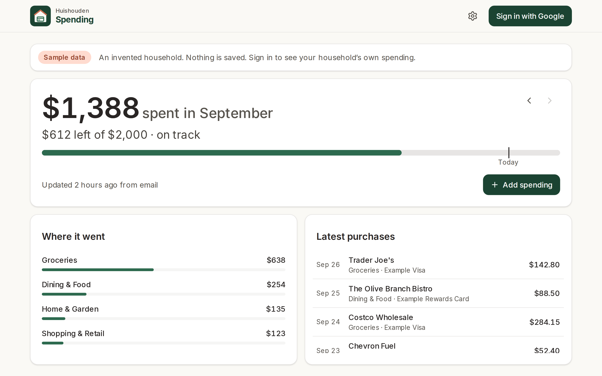
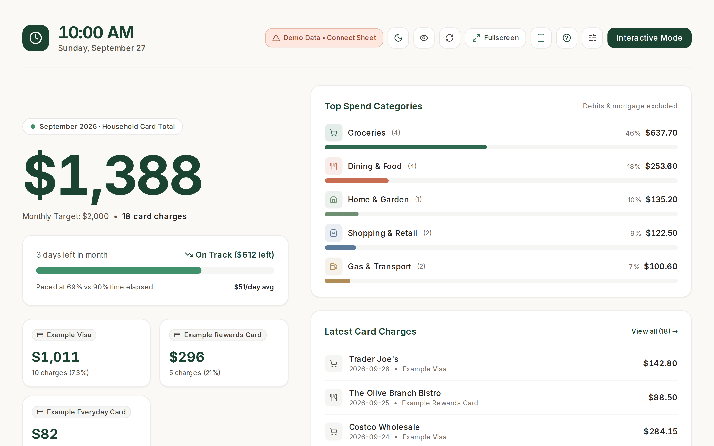

# Household spending

A wall-tablet dashboard of the household's card spending: this month against the budget, by
category and by card, with an ambient Dock Mode for the Pixel Tablet's stand. Installable as an app
on the tablet, phones and laptops. Live at https://huishouden-spending.web.app, also linked from
the [Huishouden portal](https://huishouden-piekstra.web.app).

| Dashboard | Dock Mode |
|---|---|
|  |  |

_Screenshots of the live site with its built-in sample data, refreshed by CI after each deploy._

## Where the data comes from

| Source | How it gets to the Sheet |
|---|---|
| Chase statement exports (CSV) | In-app importer, or a one-off import |
| Chase and Visa purchase alert emails | `apps-script/Code.gs`, bound to the Sheet, every 15 minutes |

The Sheet is the source of truth and the place to edit. Card names come from its **Cards** tab
(last four digits → name), so no card details live in this repo.

## Develop

```sh
bun install          # also enables the pre-commit leak scan
bun run dev          # http://localhost:3000
bun run lint && bun run test && bun run build
bun run e2e          # Playwright smoke tests against the live site (BASE_URL to override)
bun run script:push  # deploy apps-script/ to the Sheet (tests first); see apps-script/README.md
```

Built on [pwa-kit](https://github.com/piekstra/pwa-kit) and follows its
[standard](https://github.com/piekstra/pwa-kit/blob/main/STANDARD.md). Merges to `main` deploy to
Firebase Hosting (project `huishouden-piekstra`), then run the smoke tests and refresh the screenshots.
